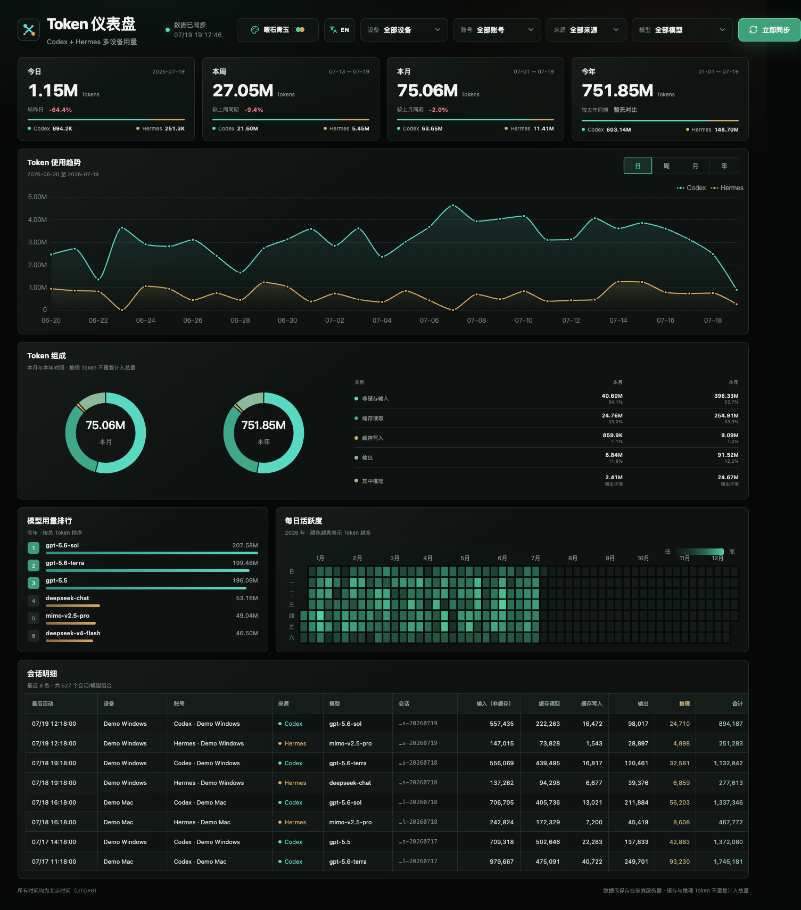
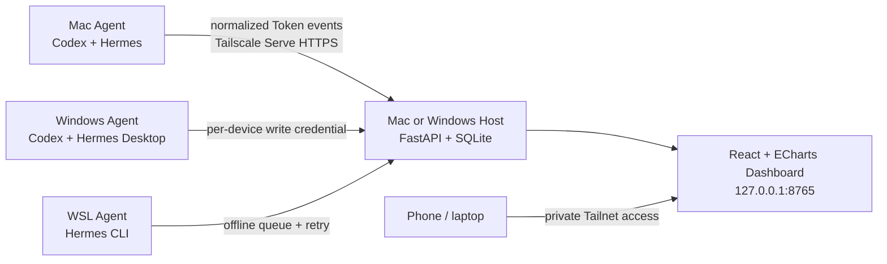
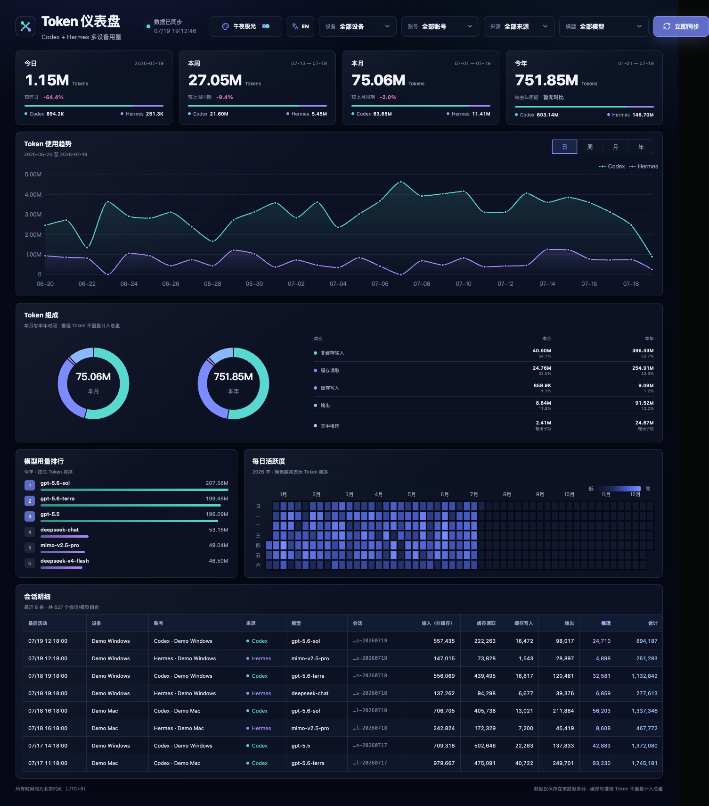
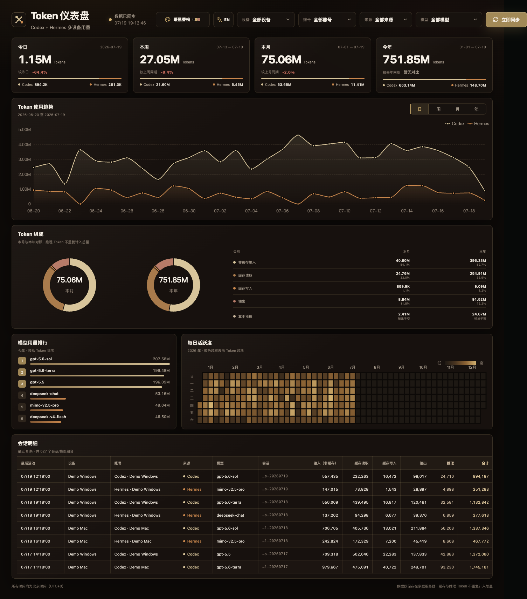

# Token Dashboard

### Multi-device, multi-account Token analytics for Codex + Hermes

[](https://github.com/xiazhanzhan/token-dashboard/actions/workflows/ci.yml)
[](https://scorecard.dev/viewer/?uri=github.com/xiazhanzhan/token-dashboard)
[](./LICENSE)
[](./docs/INSTALL-MACOS-HOST.md)
[](./docs/INSTALL-WINDOWS-HOST.md)

**English** · [简体中文](./README.zh-CN.md)

> An unofficial community project. It is not affiliated with, authorized by,
> or endorsed by OpenAI, Codex, Hermes, Nous Research, or any related vendor.

Token Dashboard is a privacy-first, self-hosted usage dashboard for people who
use Codex and Hermes across more than one computer or account. Each computer
reads its own local usage records and sends only normalized Token counters to a
Mac or Windows host that you control.

The public version is currently **0.1.0 preview**. The macOS flow has been
validated locally. The Windows Host installer should still be treated as a
preview until it has completed end-to-end validation on representative Windows
10/11 x64 machines.



> All screenshots use an isolated demo database. Device names, accounts,
> sessions, dates, and Token counts are synthetic and contain no user data.

## Why Token Dashboard?

- **One private view across devices** — combine Codex and Hermes usage from
  multiple Macs, Windows PCs, and WSL installations.
- **Mac or Windows as the host** — either platform can act as the always-on
  aggregation server and receive events from other Macs or Windows PCs.
- **Local-first by design** — the dashboard remains bound to
  `127.0.0.1:8765`; remote access and Agent uploads are intended to use your own
  Tailscale network and Tailscale Serve.
- **No conversation content** — prompts, assistant messages, API keys, and
  authentication data are not stored or uploaded.
- **Stable incremental collection** — cumulative counters, cursors, stable
  event IDs, resets, duplicates, damaged JSONL lines, and historical imports
  are handled explicitly.
- **A practical daily dashboard** — daily/weekly/monthly/yearly KPIs, trends,
  Token composition, model ranking, calendar heatmap, session details, CN/EN UI,
  and three coordinated themes.

## Architecture



The host stores normalized usage events, cursors, snapshots, device records,
and sync audit data in local SQLite. Do not put the SQLite database on a network
share and do not expose the service with Tailscale Funnel or public port
forwarding.

## Quick start

### macOS Host

1. Download `Token-Dashboard-Host-macOS.zip` from
   [GitHub Releases](https://github.com/xiazhanzhan/token-dashboard/releases).
2. Move the extracted folder to a permanent location.
3. Double-click `install.command`, then use `Token Dashboard.command` to open it.
4. Visit [http://127.0.0.1:8765](http://127.0.0.1:8765).

Detailed guide: [macOS Host installation](./docs/INSTALL-MACOS-HOST.md)

### Windows Host

1. Download `Token-Dashboard-Host-Windows-x64.zip` from
   [GitHub Releases](https://github.com/xiazhanzhan/token-dashboard/releases).
2. Extract the complete archive to a permanent local folder.
3. Run `Install-Token-Dashboard.cmd` as instructed in the package.
4. Open the dashboard with `Open-Token-Dashboard.cmd`.

Detailed guide: [Windows Host installation](./docs/INSTALL-WINDOWS-HOST.md)

Configured single-device Agent ZIP files contain a credential for one specific
host and device. Never publish or forward those packages.

## Dashboard themes

Use the palette button in the header to switch between **Obsidian Jade**
(default), **Midnight Aurora**, and **Warm Champagne**. The preference stays in
the browser under `token-dashboard.theme`; it is not added to the URL and does
not trigger data synchronization.

<details>
<summary><strong>Obsidian Jade</strong></summary>


</details>

<details>
<summary><strong>Midnight Aurora</strong></summary>



</details>

<details>
<summary><strong>Warm Champagne</strong></summary>



</details>

## Token accounting

- `Total = uncached input + cache read + cache write + output`.
- Codex cached input is a subset of input and is subtracted before aggregation
  so it is not counted twice.
- Hermes exposes cached and uncached input separately after normalization.
- Reasoning Tokens are an output subset. They are shown separately and are not
  added to the total again.
- Codex events come from cumulative counter deltas. Records that only describe
  context size without advancing the counter are ignored.
- Historical Hermes sessions may not contain per-call timestamps. The initial
  import assigns those totals to the session start date; subsequent deltas use
  the synchronization observation time.

## Local data and privacy boundary

Local Codex data is read from:

```text
~/.codex/sessions/**/*.jsonl
~/.codex/archived_sessions/*.jsonl
```

Local Hermes data is read from:

```text
~/.hermes/state.db
```

On macOS, the dashboard database and logs are stored under:

```text
~/Library/Application Support/Token Dashboard/token-dashboard.sqlite3
~/Library/Logs/Token Dashboard/
```

The repository must never contain real databases, logs, Tailnet addresses,
configured `agent-config.json` files, configured Agent ZIPs, real usage
screenshots, or session files. See [Security Policy](./SECURITY.md) and
[Safe sharing](./SHARE-SAFETY.md).

## API

- `GET /api/health`
- `POST /api/sync`
- `GET /api/summary?source=&model=&device=&account=`
- `GET /api/timeseries?granularity=day|week|month|year&from=&to=&source=&model=`
- `GET /api/models?from=&to=&source=`
- `GET /api/calendar?year=&source=&model=`
- `GET /api/sessions?source=&model=&limit=&offset=&sort=latest|tokens`

Interactive API documentation is available locally at
[http://127.0.0.1:8765/docs](http://127.0.0.1:8765/docs).

## Development

```bash
# Backend
python3 -m venv backend/.venv
backend/.venv/bin/pip install -r backend/requirements-dev.txt
backend/.venv/bin/pytest -q

# Frontend
npm --prefix frontend ci
npm --prefix frontend test -- --run
npm --prefix frontend run build
```

Build generic Host packages that contain no user database or device credential:

```bash
./scripts/build-host-packages.sh
```

Cross-platform deployment details are documented in
[CROSS_PLATFORM_DEPLOYMENT.md](./docs/CROSS_PLATFORM_DEPLOYMENT.md).

## Project status and contributing

- [Roadmap](./ROADMAP.md)
- [Changelog](./CHANGELOG.md)
- [Contributing guide](./CONTRIBUTING.md)
- [Security policy](./SECURITY.md)
- [Code of conduct](./CODE_OF_CONDUCT.md)

Bug reports, installation feedback, documentation improvements, and tested path
discoveries for Codex or Hermes are welcome. Please use synthetic fixtures and
remove device names, accounts, Tailnet addresses, session identifiers, and
credentials before posting.

## License

Released under the [MIT License](./LICENSE). Third-party component notices are
listed in [THIRD_PARTY_NOTICES.md](./THIRD_PARTY_NOTICES.md).
