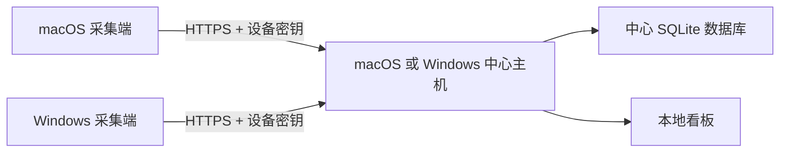

# 跨平台主机与采集端部署

本文定义 Token Dashboard 的跨平台交付边界。程序只有一套数据协议，但有两个独立角色：

- **中心主机**：保存汇总数据库、接收事件并提供看板。
- **采集端**：读取当前电脑上的 Codex/Hermes 计数，将标准化事件上报给中心主机。

中心主机和采集端的操作系统互不依赖，因此需要覆盖下面四种组合：

| 中心主机 | macOS 采集端 | Windows 采集端 |
|---|---:|---:|
| macOS | 必须支持 | 必须支持 |
| Windows | 必须支持 | 必须支持 |

每个用户部署自己的中心主机、数据库、Tailnet 和设备密钥。不同用户的部署不能共享数据库或预置地址。

## 统一数据流

采集端只上报 Token 计数、时间、来源、模型、设备/账号标签和会话哈希；不上传提示词、回复、原始 JSONL、Hermes 数据库、Cookie 或 API 密钥。

## 配置契约

每台采集端拥有独立的 `agent-config.json`。必填字段为：

| 字段 | 用途 |
|---|---|
| `server_url` | 此采集端可访问的中心主机 HTTPS 地址 |
| `device_id` | 中心主机生成的设备 ID |
| `device_token` | 仅属于此设备的写入密钥 |

推荐同时设置 `device_name`、`platform` 和 `timezone`。操作系统安装器会补充 `data_dir`、`codex_home`、`hermes_database_path` 和账号标签。完整示例：

- [`agent-config.macos.example.json`](./examples/agent-config.macos.example.json)
- [`agent-config.windows.example.json`](./examples/agent-config.windows.example.json)

示例中的占位符必须由中心主机在创建设备时替换。发布包不得包含真实密钥、个人 Tailnet 地址或个人用户名。

## 路径与后台任务

| 角色 | macOS | Windows |
|---|---|---|
| 主机数据 | `~/Library/Application Support/Token Dashboard/` | `%LOCALAPPDATA%\Token Dashboard\` |
| 采集端数据 | `~/Library/Application Support/Token Dashboard Agent/` | `%LOCALAPPDATA%\Token Dashboard Agent\` |
| Codex | `~/.codex/` | `%USERPROFILE%\.codex\` |
| Hermes | `~/.hermes/state.db` | `%USERPROFILE%\.hermes\state.db`，并可发现 WSL |
| 后台运行 | `launchd` | Task Scheduler 或 Windows Service |

以上均为每个角色的默认建议。显式配置路径应始终优先，以便支持不同磁盘、用户目录或 Hermes 安装位置。

## 两套主机逻辑

### A. macOS 作为中心主机

1. 在 Mac 上安装看板和本地采集服务。
2. 创建空的本机数据库，并注册 `local` 设备。
3. 通过 Tailnet HTTPS 暴露接收入口；看板本身仍只监听本机地址。
4. 为每台远程 Mac/Windows 分别创建设备和一次性配置。
5. macOS 采集端安装 `launchd` 任务；Windows 采集端安装 Task Scheduler 任务。
6. 在看板按设备或账号验证首批数据后，删除包含密钥的临时安装包。

### B. Windows 作为中心主机

1. 在 Windows 上安装同一后端、前端和本地采集服务；要求 Windows 10/11 x64 与 Python 3.9+。
2. 将中心数据库置于当前用户的 `%LOCALAPPDATA%`，首次运行创建空库。
3. 通过 Tailnet HTTPS 暴露相同的 `/api/v1/ingest/events` 接口；不要将 SQLite 文件设为网络共享。
4. 为每台远程 Mac/Windows 分别创建设备和一次性配置。
5. Windows 主机使用 localhost Agent 采集本机 native Codex、Hermes Desktop 与 WSL Hermes，避免中心服务重复直读。
6. 远程采集端使用与方案 A 完全相同的事件协议、认证和断线重试逻辑。
7. 使用 Task Scheduler 保持主机运行，并配置仅当前用户可读的数据目录 ACL。

## 安装包边界

构建流程产出两个不含个人数据的中心主机包，以及两个不含密钥的采集端模板：

1. `Token-Dashboard-Host-macOS`
2. `Token-Dashboard-Host-Windows-x64`
3. `Token-Dashboard-Agent-macOS`
4. `Token-Dashboard-Agent-Windows-x64`

主机安装包不能内置任何设备密钥。中心主机使用模板为每台设备生成“单设备 ZIP”；该 ZIP 必须视为密钥文件，只发送给对应设备并在安装成功后删除。

## 验收清单

### 每一种主机/采集端组合

- [ ] 主机首次运行只创建空数据库，不带开发者数据。
- [ ] 主机本机 Codex 和 Hermes 可独立同步。
- [ ] 远程采集端可同时发现 Codex 与 Hermes；缺少其中一个来源时仍可上报另一个。
- [ ] 断网时事件保存在采集端队列，恢复后补传且不会重复计数。
- [ ] 重复批次返回 `duplicate_batch`，重复事件不会新增用量。
- [ ] 主机能按设备和账号筛选 Mac/Windows 数据。
- [ ] 吊销单台设备后，其他设备不受影响。
- [ ] 日志、安装包和状态输出不泄露设备密钥或对话正文。

### 自动化测试

`backend/tests/test_cross_platform_matrix.py` 覆盖四种逻辑组合，并验证：

- 主机 OS 与采集端 OS 的身份相互独立；
- Codex/Hermes 经统一协议进入中心数据库；
- 二次同步不会重复上传；
- 原始会话 ID 不进入中心数据库；
- macOS/Windows 配置示例不包含个人地址或密钥。

这些测试验证协议和配置契约。操作系统安装器仍需分别在真实 macOS 与 Windows CI/虚拟机中执行安装、重启、卸载和权限测试。

## 分发层状态

以下跨平台分发能力已经实现：

- [x] `provision-device --platform macos|windows` 生成平台中立的安全配置。
- [x] macOS 采集端安装/卸载脚本及 `launchd` 后台任务。
- [x] Windows 中心主机安装/卸载脚本、登录启动和 00:05 快照任务。
- [x] Windows 主机的 `%LOCALAPPDATA%` 数据目录与本机聚合模式。
- [x] 主机无关的错误文案、HTTPS 地址校验与 localhost 例外。
- [x] 四种主机/采集端协议矩阵自动测试。
- [ ] macOS 与 Windows 的安装器级 CI。

在没有 Windows CI/虚拟机的 Mac 构建环境中，PowerShell 安装、任务重启和系统 ACL 仍需在真实 Windows 10/11 x64 上完成最终冒烟验证。
