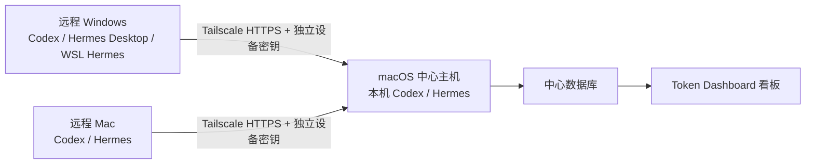

# Token Dashboard：macOS 中心主机安装与使用说明

> 适用场景：用一台 Mac（例如 Mac mini）保存汇总数据和运行看板，同时采集这台 Mac、其他 Windows 电脑以及其他 Mac 上的 Codex/Hermes Token 用量。

## 1. 先确认这是不是你要的方案

这套方案中的设备分为两种角色：

- **macOS 中心主机**：运行看板、保存唯一的中心数据库、读取本机 Codex/Hermes 数据，并接收其他电脑的统计结果。
- **远程采集端**：安装在其他 Windows 或 Mac 上，读取该电脑当前用户的 Codex/Hermes 计数，并通过 Tailscale HTTPS 上报到中心主机。



使用的中心主机安装包必须是：

```text
Token-Dashboard-Host-macOS.zip
```

不要在 Mac 中心主机上安装 `Token-Dashboard-Host-Windows-x64.zip`，也不要把不含密钥的 `.template.zip` 直接发给采集端。远程设备需要使用中心主机逐台生成的“单设备 Agent ZIP”。

---

## 2. 安装前准备

### 2.1 中心 Mac

准备以下内容：

1. 一台会长期使用、磁盘可靠的 Mac。
2. 当前 macOS 账户的登录权限。
3. **Python 3.9 或更高版本**，并且终端中能使用 `python3`。
4. 安装或更新中心主机时通常需要能访问 Python 包源；脚本每次都会尝试升级 `pip` 并安装或确认中心服务所需的 Python 组件。
5. 如需采集其他电脑：安装并登录 Tailscale。
6. 如需统计中心 Mac 自己的数据，数据应位于程序默认读取位置：
   - Codex：`~/.codex/sessions/` 和 `~/.codex/archived_sessions/`
   - Hermes：`~/.hermes/state.db`

安装包已经包含构建好的网页界面，**普通安装不需要 Node.js 或 npm**。

### 2.2 所有远程设备

- 中心 Mac 和所有远程设备必须能够通过同一个 Tailnet 互相访问。共享 Tailnet 时，还要确保 Tailnet 的访问规则允许这些设备访问中心 Mac。
- Windows 采集包自带 x64 便携式 Python，不要求用户另装 Windows Python。
- macOS 采集端需要本机已有 Python 3.9 或更高版本。
- Windows 中的 WSL Hermes 若要被发现，对应 WSL 发行版内还需要 `python3`，或可用的 Hermes Agent Python 环境。

Tailscale 官方资料：

- [在 macOS 安装 Tailscale](https://tailscale.com/docs/install/mac)
- [Tailscale Serve 说明](https://tailscale.com/docs/features/tailscale-serve)
- [Tailscale Serve 命令参考](https://tailscale.com/docs/reference/tailscale-cli/serve)

### 2.3 运行条件

中心服务和 macOS 采集端使用当前用户的 `launchd` 后台任务。因此：

- 用户登录后，后台任务会自动运行；锁屏不影响运行。
- Mac 关机、注销、断网或睡眠时，远程设备无法上报。
- Mac 唤醒且 Tailscale 恢复连接后，采集端会继续补传。

---

## 3. 把中心主机解压到稳定目录

这是最容易被忽略、但非常重要的一步。

安装程序会把中心主机文件夹的**绝对路径**写入 macOS 后台任务。安装后如果移动、改名或删除这个文件夹，后台服务就会找不到程序。

推荐做法：

1. 双击 `Token-Dashboard-Host-macOS.zip` 解压。
2. 在自己的用户目录中新建 `Applications` 文件夹（如果已经存在则直接使用）。
3. 把解压得到的整个文件夹移动到下面的位置：

   ```text
   ~/Applications/Token-Dashboard-Host-macOS
   ```

4. 确认该文件夹中可以看到这些文件：

   ```text
   install.command
   Token Dashboard.command
   Configure Tailscale Serve.command
   Create Remote Agent.command
   Backup Token Dashboard.command
   Manage Remote Devices.command
   ```

建议不要从“下载”目录、临时目录、U 盘、网络共享目录或会被清理的软件缓存目录直接安装。安装后也不要随意移动主机文件夹。

> 如果以后确实移动了文件夹，请在新位置重新双击 `install.command`，让后台任务记录新的路径。

---

## 4. 安装 macOS 中心主机

### 4.1 开始安装

1. 打开稳定目录中的 `Token-Dashboard-Host-macOS` 文件夹。
2. 双击 **`install.command`**。
3. 等待安装窗口依次完成：
   - 检查 Python；
   - 创建专用 Python 环境；
   - 安装后端依赖；
   - 使用安装包中已构建的看板；
   - 安装中心服务后台任务；
   - 安装每天 00:05 的快照任务；
   - 首次读取本机 Codex/Hermes 并补齐历史快照。
4. 出现“安装完成”后按回车关闭窗口。

安装程序会创建并保护以下目录：

```text
中心数据库：~/Library/Application Support/Token Dashboard/token-dashboard.sqlite3
中心日志：  ~/Library/Logs/Token Dashboard/
```

它还会安装两个当前用户的后台任务：

```text
com.local.token-dashboard.server
com.local.token-dashboard.snapshot
```

中心网页服务只监听：

```text
http://127.0.0.1:8765
```

这意味着局域网设备不能直接通过 Mac 的局域网 IP 访问 8765 端口。后续的跨设备访问由 Tailscale Serve 转发。

### 4.2 macOS 阻止打开时

这些 `.command` 文件不是 App Store 应用。若 macOS 提示无法验证开发者：

1. 在 Finder 中按住 Control 点击该文件，选择“打开”；或
2. 打开“系统设置 → 隐私与安全性”，在刚才的拦截提示旁选择允许，然后再次打开。

只应对来自可信交付方、文件名与本说明一致的安装包这样操作。

### 4.3 打开看板

以后双击：

```text
Token Dashboard.command
```

它会检查后台服务、在需要时启动服务，并打开：

[http://127.0.0.1:8765](http://127.0.0.1:8765)

正常安装后，中心服务由后台任务保持运行，不需要一直保留启动窗口。若后台任务异常，`Token Dashboard.command` 会尝试启动一个备用服务；只有这种备用模式会在关闭对应终端窗口时停止。

### 4.4 首次检查

打开网页后检查：

- 页面能够显示，而不是“无法连接”；
- 顶部“设备”中能看到中心 Mac；
- 若本机已经使用过 Codex 或 Hermes，相应统计能够出现；
- 如果本机只有 Codex 或只有 Hermes，另一个来源显示“未找到”或“尚未同步”属于正常情况，不代表安装失败。

---

## 5. 用 Tailscale Serve 开放私有 HTTPS 入口

只有需要接收其他电脑的数据时才需要本节。仅看中心 Mac 本机数据时，可以跳过。

### 5.1 配置步骤

1. 确认中心 Mac 上的 Tailscale 已安装、已登录并显示已连接。
2. 先确认本地看板 [http://127.0.0.1:8765](http://127.0.0.1:8765) 能打开。
3. 双击中心主机文件夹中的：

   ```text
   Configure Tailscale Serve.command
   ```

4. 脚本实际配置的是：

   ```text
   tailscale serve --bg http://127.0.0.1:8765
   ```

5. 第一次使用 Serve 时，Tailscale 可能要求在浏览器中确认启用 HTTPS；按页面提示完成。
6. 记录窗口中显示的 HTTPS 地址，通常类似：

   ```text
   https://your-mac.your-tailnet.ts.net
   ```

这个地址既是 Tailnet 内访问看板的地址，也是之后写入每个 Agent ZIP 的中心主机地址。

### 5.2 必须遵守的安全边界

- **只使用 Tailscale Serve，不要启用 Funnel。** Funnel 会把服务开放到公网，而本方案只为私有 Tailnet 设计。
- 不要把地址写成 `http://Mac局域网IP:8765` 或 `http://100.x.x.x:8765`。远程配置只接受 HTTPS，本地服务也没有监听这些地址。
- **看板和只读 API 没有应用层登录或读取密码。** Serve 会把整个看板入口提供给 Tailnet 内被访问规则允许的成员；读取权限必须依赖 Tailnet ACL/Grants。应只允许受信任的人和设备访问中心 Mac。
- 不要把中心 SQLite 数据库放到 NAS、SMB、iCloud 共享目录或 Windows 共享盘供多台电脑共同打开。所有远程设备都应通过 Agent 上报。

### 5.3 从远程设备验证 HTTPS

在一台已经加入同一 Tailnet 的远程电脑上，用浏览器打开刚才记录的 HTTPS 地址。

- 能看到看板：Tailnet 与 Serve 基本正常。
- 无法访问：先不要生成 Agent ZIP，转到本文“故障排查 → Tailscale/HTTPS”。

---

## 6. 为每台远程电脑生成独立 Agent ZIP

### 6.1 一台设备生成一次

每台远程电脑必须有自己独立的设备 ID 和写入密钥。不要把同一个 ZIP 安装到两台电脑，否则两台电脑会冒用同一设备身份，筛选、吊销和故障定位都会失真。

推荐命名示例：

- `Office-Windows`
- `Home-PC`
- `MacBook-Air`
- `Studio-Mac`

设备名称必须非空，并且不能与中心数据库中已有设备重名。

### 6.2 生成步骤

1. 双击中心主机文件夹中的：

   ```text
   Create Remote Agent.command
   ```

2. 输入设备名称。
3. 选择设备系统：
   - 输入 `W`：Windows；
   - 输入 `M`：macOS。
4. 输入中心主机 HTTPS 地址。
   - 如果脚本已经从 Tailscale 识别出默认地址，可直接按回车接受；
   - 应与“Configure Tailscale Serve.command”显示的地址一致；
   - 必须以 `https://` 开头。
5. 脚本会立刻在中心数据库中注册设备，并在当前 Mac 的“下载”目录生成单设备安装包：

   ```text
   ~/Downloads/Token-Dashboard-Agent-设备名-windows.zip
   ~/Downloads/Token-Dashboard-Agent-设备名-macos.zip
   ```

   为保证文件名安全，中文或特殊符号可能被简化，但看板中的设备显示名称仍使用输入的原名称。

6. 只把这个 ZIP 发送给对应的那一台设备。

### 6.3 ZIP 是密钥文件

生成后的 ZIP 内含明文 `agent-config.json`，其中包含该设备唯一的写入密钥。请做到：

- 不发到群聊；
- 不保存到公共网盘；
- 不复用到其他电脑；
- 不把配置内容复制到工单、截图或聊天；
- 验证安装成功后，删除中心 Mac 上的 ZIP、传输副本和远程电脑上的 ZIP。

安装器会在成功后删除解压目录中的 `agent-config.json`，但**无法替你删除原始 ZIP**。macOS 和 Windows 安装器都会把卸载脚本复制到正式运行目录，因此安装完成后可以删除整个解压目录。

---

## 7. 在远程 macOS 安装采集端

### 7.1 安装前确认

- 远程 Mac 已安装并登录 Tailscale；
- 它与中心 Mac 位于同一 Tailnet，且浏览器能打开中心 HTTPS 地址；
- 本机存在 Python 3.9 或更高版本，可使用 `python3`；
- 使用的是专门为这台 Mac 生成、文件名以 `-macos.zip` 结尾的 ZIP。

### 7.2 安装步骤

1. 在远程 Mac 上解压单设备 ZIP。
2. 打开解压后的文件夹。
3. 双击：

   ```text
   Install-Token-Agent.command
   ```

4. 若 macOS 阻止打开，按“4.2 macOS 阻止打开时”的方法选择允许。
5. 安装器会：
   - 把采集程序复制到当前用户的应用数据目录；
   - 把卸载脚本和说明文件复制到同一正式运行目录；
   - 把设备配置保存为仅当前用户可读；
   - 固定读取 `~/.codex` 和 `~/.hermes/state.db`；
   - 安装 `com.local.token-dashboard.agent` 后台任务；
   - 启动持续运行的 Agent，每 60 秒采集和上报一次；
   - 尝试立即进行第一次同步；
   - 删除解压目录里的 `agent-config.json`。
6. 看到“安装完成”后按回车关闭窗口。

采集端数据和日志位于：

```text
~/Library/Application Support/Token Dashboard Agent/
```

如果第一次连接失败，安装器会显示警告，但后台任务已经安装；网络恢复后会自动重试。

### 7.3 安装后清理

确认中心看板收到数据后，删除：

- 下载的单设备 ZIP；
- 邮件、聊天工具或 Taildrop 中的传输副本。

安装成功后，解压目录中的 `agent-config.json` 应已被安装器删除。卸载脚本已复制到正式运行目录，因此可以删除整个解压目录。

不要删除 `~/Library/Application Support/Token Dashboard Agent/`，这是正式运行目录，也保存断线时尚未上传的队列。

---

## 8. 在远程 Windows 安装采集端

### 8.1 能采集哪些位置

Windows Agent 会检查：

- Windows Codex：`%USERPROFILE%\.codex`
- Hermes Desktop / Windows 原生 Hermes：优先检查 `HERMES_HOME`，然后检查：
  - `%LOCALAPPDATA%\hermes\state.db`
  - `%USERPROFILE%\.hermes\state.db`
- 每个已安装 WSL 发行版中的旧版 Hermes CLI：`~/.hermes/state.db`

WSL 部分不会上传原始 Hermes 数据库。它会先在 Windows Agent 本机生成一个精简 SQLite 副本，其中包含 `sessions` 表里统计所需的会话 ID、开始时间、模型和各类 Token 计数，不包含提示词或消息。原始会话 ID 只留在 Agent 本机，真正上报前会被哈希处理。

### 8.2 安装前确认

- 设备是 Windows x64；
- Windows Tailscale 已连接到与中心 Mac 相同的 Tailnet；
- 浏览器能打开中心 HTTPS 地址；
- 使用的是专门为这台电脑生成、文件名以 `-windows.zip` 结尾的 ZIP；
- 若需要采集 WSL Hermes，先确保对应 WSL 发行版已能启动，并且其中已有 Python。

Windows Agent 包已包含便携式 Python，采集 Windows 原生 Codex/Hermes 时不需要另外安装 Python。

### 8.3 安装步骤

1. 把 ZIP **完整解压**到 Windows 本地普通文件夹。不要直接在压缩包预览窗口中运行。
2. 双击：

   ```text
   Install-Token-Agent.cmd
   ```

3. 保持窗口打开。安装器会：
   - 检查单设备配置和便携式 Python；
   - 检查 Tailscale 是否已经连接；
   - 安装到 `%LOCALAPPDATA%\Token Dashboard Agent`；
   - 把卸载脚本和说明文件复制到同一正式运行目录；
   - 限制配置文件只供当前 Windows 用户读取；
   - 扫描 Windows 原生 Hermes 和全部 WSL 发行版；
   - 首次提交 Windows Codex 和 Hermes Desktop 历史，并尝试提交已发现的 WSL Hermes 历史；
   - 创建名为 `Token Dashboard Agent` 的每分钟计划任务；
   - 成功后删除解压目录中的 `agent-config.json`。
4. 只有看到绿色的：

   ```text
   Installation completed.
   ```

   才表示完整安装成功。
5. 按任意键关闭窗口。

正式运行目录：

```text
%LOCALAPPDATA%\Token Dashboard Agent
```

其中 `hermes-locations.txt` 会记录安装时找到的 Windows/WSL Hermes 位置，`scheduled-task.log` 是每分钟任务日志。

### 8.4 安装失败时

Windows 安装器要求 Windows 原生 Codex/Hermes 的第一次主同步成功后才创建计划任务。单个 WSL 导出失败会写入警告并跳过该 WSL，但不一定阻止其他来源完成安装。如果没有出现 `Installation completed.`：

1. 不要删除解压目录；
2. 根据窗口错误检查 Tailscale、中心地址或中心主机状态；
3. 修复后再次双击 `Install-Token-Agent.cmd`。

成功后删除 ZIP、传输副本和整个解压目录。卸载脚本已经复制到正式运行目录。

---

## 9. 验证整套系统

建议对每台新设备逐项验收。

### 9.1 验证中心主机

- [ ] 中心 Mac 上能打开 `http://127.0.0.1:8765`。
- [ ] 中心服务在关闭普通 Finder/浏览器窗口后仍能运行。
- [ ] 双击 `Token Dashboard.command` 能重新打开看板。
- [ ] 本机有 Codex/Hermes 数据时能看到相应记录。

### 9.2 验证 Tailnet

- [ ] 中心 Mac 已运行 `Configure Tailscale Serve.command`。
- [ ] 远程设备浏览器能打开 `https://…ts.net` 地址。
- [ ] 没有启用 Funnel。

### 9.3 验证远程设备

1. 安装 Agent 后等待约 1 分钟，再刷新中心看板。
2. 在顶部“设备”筛选中选择刚创建的设备。
3. 分别选择 Codex 和 Hermes 检查数据。
4. 在会话列表中确认设备名称和账号标签正确。
5. 如果该电脑还没有实际 Codex/Hermes 用量，先在对应工具中产生一次新会话，再等待下一次同步。

> 看板的“立即同步”按钮只会让**中心 Mac 重新读取中心 Mac 自己的文件**，不会远程命令其他 Agent 立即运行。远程 Agent 会按自己的每分钟任务自动上报。

### 9.4 查看设备是否上报

需要精确检查设备 ID、启用状态和最后上报时间时，双击中心主机文件夹中的：

```text
Manage Remote Devices.command
```

窗口会列出当前设备。此时只查看、不吊销时，直接按回车，再按一次回车关闭窗口。

高级用户也可以在中心 Mac 的“终端”中进入稳定安装目录后运行同一个底层查询：

```bash
cd "$HOME/Applications/Token-Dashboard-Host-macOS"
PYTHONPATH=backend backend/.venv/bin/python -m app.cli devices
```

看到对应设备的 `last_seen_at` 不再为空，表示中心主机已经通过设备密钥接受过上报。

---

## 10. 日常使用

### 10.1 平时要做什么

1. 保持中心 Mac 开机、当前用户已登录、网络正常。
2. 保持中心 Mac 的 Tailscale 已连接。
3. 保持远程设备在需要统计时登录到安装 Agent 的那个用户账户。
4. 需要查看时双击 `Token Dashboard.command`，或直接打开本地地址。

正常情况下不需要手动启动服务器：

- 中心服务由 `com.local.token-dashboard.server` 保持运行；
- 中心服务启动时会同步一次本机数据，之后每 60 秒同步；
- `com.local.token-dashboard.snapshot` 每天 00:05 执行同步和快照，并在加载时补齐缺失日期；
- macOS Agent 持续运行并每 60 秒同步；
- Windows Agent 由计划任务每分钟运行一次。

### 10.2 看板筛选

顶部可以按以下维度筛选：

- 设备：中心 Mac 或某台远程电脑；
- 账号：某设备下的 Codex/Hermes 标签；
- 来源：Codex 或 Hermes；
- 模型。

如果某设备只有一个来源，另一个来源为空并不影响已有数据。

### 10.3 睡眠和关机

- 中心 Mac 睡眠/关机期间，网页和接收接口都不可用。
- 远程 Agent 会把尚未成功提交的事件保存在自己的本地 Agent 数据库中。
- 中心 Mac 唤醒、Tailscale 恢复后，Agent 下一次运行会继续补传。
- 中心主机使用事件 ID 和批次 ID 去重；网络重试不会正常地造成重复计数。

不要在远程设备还有待传数据时直接删除 Agent 数据目录，否则未上传队列会一并丢失。

---

## 11. 隐私与安全

### 11.1 远程 Agent 会发送什么

远程 Agent 发送：

- Token 计数；
- 时间；
- 数据来源；
- 模型名称；
- 设备和账号标签；
- 经过哈希处理的会话标识。

远程 Agent 不发送：

- 提示词或回复正文；
- 原始 Codex JSONL；
- 原始 Hermes 数据库；
- Cookie、API Key 或 Codex/Hermes 认证文件；
- 原始会话 ID。

中心主机本机数据由中心服务在本地直接读取，不经过远程网络。

### 11.2 必做安全事项

- 每台设备使用不同的 Agent ZIP。
- 安装成功并验证后删除所有 ZIP 和传输副本。
- 设备丢失、转交他人或密钥可能泄露时，立即在中心主机吊销。
- 只使用自己控制的 Tailnet，并按需要限制 Tailnet 访问规则。
- 不启用 Funnel。
- 不通过文件共享直接开放 SQLite 数据库。
- 不公开中心日志、Agent 日志、配置文件或数据库备份。

看板和只读 API 当前没有单独的应用登录密码。设备写入接口需要各自的长期设备密钥，但任何被 Tailnet 访问规则允许连接 Serve 地址的成员，都可能打开完整看板并读取汇总数据。因此应使用私有 Tailnet，并通过 Tailscale ACL/Grants 只允许受信任的人和设备访问中心 Mac。

设备密钥不是“安装一次即失效”的验证码；在中心主机吊销前一直有效。含密钥的单设备 ZIP 泄漏时，应立即吊销对应 `dev_...` 设备。

### 11.3 数据和密钥分别保存在哪里

| 内容 | 默认位置 | 敏感性 |
|---|---|---|
| 中心数据库 | `~/Library/Application Support/Token Dashboard/` | 完整汇总历史、设备信息 |
| 中心日志 | `~/Library/Logs/Token Dashboard/` | 运行状态与错误 |
| macOS Agent 配置/队列 | `~/Library/Application Support/Token Dashboard Agent/` | 设备密钥、未上传事件 |
| Windows Agent 配置/队列 | `%LOCALAPPDATA%\Token Dashboard Agent` | 设备密钥、未上传事件 |
| 单设备 ZIP | 生成时位于中心 Mac 的“下载”目录 | 明文设备密钥，安装后应删除 |

Agent 自己的本地 SQLite 队列还会保存源文件路径和原始会话 ID，用于增量读取与断线补传，因此远程设备上的 Agent 数据目录也必须按敏感数据保护。

### 11.4 当前版本边界

- 所有日期默认按 `Asia/Shanghai` 汇总，当前普通界面没有时区切换。
- 每个 Agent 只读取安装它的当前操作系统用户，不读取同一电脑的其他登录账号。
- 中心数据库、Agent 队列和日志没有自动容量上限或日志轮转；长期使用应定期检查磁盘空间。
- 一个部署只能有一个权威中心，不支持 Mac/Windows 两个中心同时双向合并同一批 Agent。
- 恢复较旧的中心备份后，Agent 不会自动重传已经标记为成功送达的历史事件；不能把 Agent 队列当作中心数据库备份。

---

## 12. 备份中心数据

### 12.1 创建备份

在中心主机文件夹中双击：

```text
Backup Token Dashboard.command
```

脚本会使用 SQLite 的在线备份功能创建一致的数据库副本，默认保存到：

```text
~/Documents/Token Dashboard Backups/
```

文件名格式为：

```text
token-dashboard-YYYYMMDD-HHMMSS.sqlite3
```

备份包含完整 Token 历史和设备信息，但不包含：

- 中心主机程序文件；
- 中心日志；
- 远程 Agent 本地尚未上传的队列；
- Tailscale 登录和 Serve 配置。

### 12.2 备份建议

- 首次部署完成后备份一次；
- 添加多台设备后备份一次；
- 更新或卸载前备份；
- 之后按自己的数据重要程度定期备份；
- 至少保留两个不同日期的备份；
- 备份放在加密磁盘或私有存储中。

如果 macOS 的“桌面与文稿”正在同步到 iCloud，默认 `Documents` 目录可能会自动上传。请确认云端账户安全，或把生成的备份移到明确受控的加密位置。不要上传到公共网盘或公开分享。

### 12.3 恢复备份

> **重要：Agent 队列不能代替中心数据库备份。** Agent 会按相同的 `server_url` 记住哪些事件已经被中心主机成功接收。若把中心数据库恢复到较早时间点，备份之后已经上传成功、并在 Agent 本地标记为“已送达”的事件不会自动重传；只有仍未成功送达的待传事件会继续上传。因此，恢复旧备份可能造成中心数据缺口。不要把“远程 Agent 还保留本地数据库”当成可恢复保证，也不要自行修改 Agent 的送达记录。

当前安装包没有一键恢复按钮。恢复会替换正在使用的中心数据库，建议由熟悉文件操作的管理员执行。应优先保留最新中心数据库并寻求管理员恢复；确认必须回退时，安全顺序是：

1. 先再创建一次当前状态备份；
2. 从旧安装目录运行 `scripts/uninstall-launch-agent.sh`，停止中心后台任务；
3. 保留当前数据库副本，并移走同目录下可能存在的 `-wal`、`-shm` 文件；
4. 把目标备份复制为：

   ```text
   ~/Library/Application Support/Token Dashboard/token-dashboard.sqlite3
   ```

5. 回到稳定安装目录，重新双击 `install.command`；
6. 打开看板核对日期、设备和总量。

恢复旧备份会回到备份当时的设备登记和吊销状态。备份之后新创建的 Agent 密钥可能不再被识别；已经被旧中心确认送达的备份后事件也不会因回退而自动重传。因此恢复后既要逐台验证远程上报，也要核对备份时间点之后的历史是否存在缺口。

---

## 13. 更新中心主机

当前安装包没有自动更新器。更新时不要直接在正在运行的目录里随意覆盖零散文件。

推荐顺序：

1. 双击 `Backup Token Dashboard.command` 创建备份。
2. 下载新的 `Token-Dashboard-Host-macOS.zip` 并在临时位置解压。
3. 打开“终端”，从旧稳定目录运行：

   ```bash
   cd "$HOME/Applications/Token-Dashboard-Host-macOS"
   ./scripts/uninstall-launch-agent.sh
   ```

   它只移除中心服务和快照后台任务，不删除数据。
4. 把旧程序文件夹改名为例如 `Token-Dashboard-Host-macOS-old`，暂时保留。
5. 把新解压出的文件夹移动到原来的稳定路径：

   ```text
   ~/Applications/Token-Dashboard-Host-macOS
   ```

6. 双击新目录中的 `install.command`。安装程序会重新创建运行环境和后台任务，并继续使用 `~/Library/Application Support/Token Dashboard/` 中的原数据库。
7. 打开看板，检查本机与远程设备数据。
8. 验证无误后再删除旧程序文件夹。

更新中心主机不会自动更新已经安装在其他电脑上的 Agent。只要协议兼容，现有 Agent 可以继续使用；只有发布说明明确要求更新采集端时，才重新登记新设备、安装新 Agent 并吊销旧设备。

---

## 14. 吊销远程设备

吊销会让该设备的密钥立即失效，但不会删除它过去已经上传的历史，也不会影响其他设备。

### 14.1 打开设备管理入口

在中心主机文件夹中双击：

```text
Manage Remote Devices.command
```

窗口会先列出全部当前设备。找到目标设备的 `id`，格式类似：

```text
dev_0123456789abcdef
```

不要选择 `local`；中心主机本机设备不能通过这个命令吊销。

### 14.2 执行吊销

1. 在提示后输入完整的 `dev_…` 设备 ID，然后按回车。
2. 再输入大写确认词：

   ```text
   REVOKE
   ```

3. 确认后，窗口会显示底层吊销结果和“设备已吊销”。

只想查看、不想吊销时，在设备 ID 提示处直接按回车即可。脚本不会接受不以 `dev_` 开头的 ID，也不会吊销中心本机的 `local` 设备。

高级用户也可以使用底层命令：

```bash
cd "$HOME/Applications/Token-Dashboard-Host-macOS"
PYTHONPATH=backend backend/.venv/bin/python -m app.cli revoke-device dev_0123456789abcdef
```

返回结果中的 `updated` 为 `1`，表示设备已被禁用。此后该 Agent 上报会收到认证失败。

### 14.3 什么时候先卸载、什么时候先吊销

- **设备丢失或密钥疑似泄露**：立刻先吊销。
- **计划停用且设备仍在手边**：先让设备联网完成最后一次同步，再吊销，然后卸载 Agent。

如果以后重新启用同一台电脑，应生成新的单设备 ZIP，不要恢复旧密钥。由于旧设备记录仍保留，创建新登记时请使用新的唯一名称，例如在原名称后加 `-new`。

---

## 15. 卸载

### 15.1 卸载远程 macOS Agent

1. 先按上一节在中心主机吊销设备。
2. 在 Finder 中前往下面的正式运行目录：

   ```text
   ~/Library/Application Support/Token Dashboard Agent/
   ```

3. 双击其中的：

   ```text
   Uninstall-Token-Agent.command
   ```

4. 该脚本只移除 `com.local.token-dashboard.agent` 后台任务，历史队列和配置仍保留在：

   ```text
   ~/Library/Application Support/Token Dashboard Agent
   ```

5. 确认不再需要待传队列后，手动删除该目录。

### 15.2 卸载远程 Windows Agent

1. 先在中心主机吊销设备。
2. 在资源管理器地址栏输入并打开正式运行目录：

   ```text
   %LOCALAPPDATA%\Token Dashboard Agent
   ```

3. 双击其中的：

   ```text
   Uninstall-Token-Agent.cmd
   ```

4. 脚本会删除名为 `Token Dashboard Agent` 的计划任务，但保留：

   ```text
   %LOCALAPPDATA%\Token Dashboard Agent
   ```

5. 确认不再需要待传队列后，手动删除该目录。

### 15.3 暂停或卸载 macOS 中心主机

打开“终端”，运行稳定安装目录中的：

```bash
cd "$HOME/Applications/Token-Dashboard-Host-macOS"
./scripts/uninstall-launch-agent.sh
```

它会移除中心服务和每日快照任务，但保留程序、数据库和日志。以后重新双击 `install.command` 即可重新安装后台任务。

### 15.4 完全删除中心主机

1. 先创建并妥善保存数据库备份。
2. 吊销或卸载所有远程 Agent。
3. 按“15.3”的终端步骤运行 `scripts/uninstall-launch-agent.sh`。
4. 停用为本看板配置的 Tailscale Serve。
   - 先用 `tailscale serve status` 查看现有映射；
   - 如果该 Mac 只为 Token Dashboard 使用 Serve，可用 `tailscale serve reset` 清除 Serve 配置；
   - 如果还有其他 Serve 项目，不要直接 reset，应按 [Tailscale Serve 命令参考](https://tailscale.com/docs/reference/tailscale-cli/serve) 只关闭本看板映射。
   - 如果终端提示找不到 `tailscale`，可把上述命令中的 `tailscale` 替换为 `/Applications/Tailscale.app/Contents/MacOS/Tailscale`；这也是随包配置脚本使用的后备路径。
5. 删除稳定程序目录。
6. 只有确认不再需要历史后，才删除：

   ```text
   ~/Library/Application Support/Token Dashboard/
   ~/Library/Logs/Token Dashboard/
   ~/Documents/Token Dashboard Backups/
   ```

不要仅删除程序目录而保留后台任务，否则 macOS 会持续尝试启动一个已不存在的路径。

---

## 16. 故障排查

### 16.1 双击脚本无反应或提示不能打开

按以下顺序检查：

1. 确认 ZIP 已完整解压，而不是在压缩包预览中运行。
2. Control 点击 `.command` 文件，选择“打开”。
3. 到“系统设置 → 隐私与安全性”允许刚才被阻止的文件。
4. 确认文件仍在稳定安装目录，且没有被改名或单独拖走。

### 16.2 安装提示“需要 Python 3”

在中心 Mac 或远程 Mac 安装 Python 3.9+，然后重新双击安装脚本。可在“终端”检查：

```bash
python3 --version
```

Windows Agent 包已有便携式 Python；Windows 出现“Portable Python runtime is missing”通常说明 ZIP 没有完整解压、文件被安全软件隔离，或拿错了安装包。

### 16.3 安装依赖失败

中心主机安装或更新时都会执行 Python 依赖安装，并可能需要访问 Python 包源。检查：

- Mac 能否正常联网；
- 公司代理/防火墙是否阻止 Python 包下载；
- 磁盘是否可写且空间足够；
- 不要从只读磁盘或受管控的网络目录运行。

修复后可直接重新运行 `install.command`。

### 16.4 本地看板打不开

1. 再次双击 `Token Dashboard.command`。
2. 确认浏览器地址是 `http://127.0.0.1:8765`。
3. 检查中心日志：

   ```text
   ~/Library/Logs/Token Dashboard/server.log
   ~/Library/Logs/Token Dashboard/server-error.log
   ```

4. 如果提示 8765 端口被占用，关闭占用该端口的其他程序后再打开。
5. 如果安装后移动过主机文件夹，在当前位置重新运行 `install.command`。

高级检查：

```bash
curl http://127.0.0.1:8765/api/health
```

能返回 JSON 表示中心 API 正在运行。

### 16.5 本机 Codex 或 Hermes 显示不可用

确认当前登录用户下存在：

```text
Codex：~/.codex/sessions/ 或 ~/.codex/archived_sessions/
Hermes：~/.hermes/state.db
```

程序允许其中一个来源缺失。刚开始使用对应工具时，先产生一条真实会话，再等待中心的下一次 60 秒同步。

### 16.6 Tailscale/HTTPS 地址无法访问

依次检查：

1. 中心 Mac 和远程设备的 Tailscale 都显示已连接。
2. 两台设备属于同一 Tailnet，或已按 Tailnet 规则获准互访。
3. 中心本地地址先能打开。
4. 在中心 Mac 重新双击 `Configure Tailscale Serve.command`。
5. 使用窗口显示的完整 `https://…ts.net` 地址，不要改成 IP 或 HTTP。
6. 查看当前 Serve 状态：

   ```bash
   tailscale serve status
   ```

   如果终端提示找不到 `tailscale`，改用：

   ```bash
   /Applications/Tailscale.app/Contents/MacOS/Tailscale serve status
   ```

7. 如果 Tailscale 要求启用 HTTPS，完成其浏览器确认流程。

`Configure Tailscale Serve.command` 只负责设置转发；它不会替中心服务修复 8765 端口故障。

### 16.7 创建 Agent ZIP 失败

常见原因：

- 尚未运行 `install.command`；
- 设备名称为空；
- 设备名称与现有设备重复；
- 服务器地址不是 HTTPS；
- 安装包中的 `dist/templates` 缺失；
- “下载”目录不可写。

如果失败发生在中心数据库已登记设备之后，设备列表中可能留下一个尚未使用的登记。双击 `Manage Remote Devices.command` 找到并吊销它；重新创建时换一个唯一名称。

### 16.8 macOS Agent 没有上报

先等 1～2 分钟并刷新看板，然后检查：

```text
~/Library/Application Support/Token Dashboard Agent/agent.log
~/Library/Application Support/Token Dashboard Agent/launchd.log
~/Library/Application Support/Token Dashboard Agent/launchd-error.log
```

重点确认：

- 远程 Mac 的 Tailscale 在线；
- HTTPS 地址在远程浏览器中可打开；
- 安装 Agent 的 macOS 用户仍已登录；
- `~/.codex` 或 `~/.hermes/state.db` 确实有数据；
- 中心主机没有吊销该设备。

### 16.9 Windows Agent 没有上报

检查：

```text
%LOCALAPPDATA%\Token Dashboard Agent\scheduled-task.log
%LOCALAPPDATA%\Token Dashboard Agent\hermes-locations.txt
```

并在“任务计划程序”中确认存在：

```text
Token Dashboard Agent
```

如果初次安装从未出现 `Installation completed.`，修复网络后从保留的解压目录重新运行 `Install-Token-Agent.cmd`。

### 16.10 Windows 能采集原生 Hermes，但没有 WSL Hermes

打开 `hermes-locations.txt`。安装器只会登记安装当时同时满足以下条件的 WSL 发行版：

- 存在 `~/.hermes/state.db`；
- 发行版能正常启动；
- 能找到 `python3` 或 Hermes Agent 自带的 Python。

先在 WSL 中修复这些条件。若是在安装完成后才新增 WSL/Hermes，现有安装不会自动重新发现新发行版；应按新设备登记流程重新安装新版 Agent，并吊销旧登记。

### 16.11 日志出现 HTTP 401

这表示设备密钥无效或已被吊销。不要从聊天记录寻找旧密钥，也不要手工修改配置。正确做法是：

1. 在中心主机确认并吊销旧登记；
2. 使用新的唯一设备名称生成新 ZIP；
3. 卸载旧 Agent；
4. 安装新 Agent并验证；
5. 删除新 ZIP 的全部副本。

### 16.12 断网后数据没有立刻补齐

- 先保持中心 Mac、远程设备和双方 Tailscale 在线数分钟；
- 大量历史会分批提交，每批最多 200 个事件；
- 不要重复安装或删除 Agent 数据目录；
- 查看 Agent 日志是否仍有连接错误；
- 在看板按设备和来源筛选，避免误以为数据归到了本机。

---

## 17. 最终验收清单

- [ ] 中心包是 `Token-Dashboard-Host-macOS.zip`。
- [ ] 中心主机已放在不会移动的稳定目录。
- [ ] `install.command` 已完成，中心本地网页能打开。
- [ ] Tailscale Serve 使用私有 HTTPS，未启用 Funnel。
- [ ] 每台远程电脑都有独立 ZIP，没有复用密钥。
- [ ] Windows 和 macOS Agent 均按各自脚本安装成功。
- [ ] 看板能按设备和账号筛选到首批数据。
- [ ] 所有含密钥的 ZIP、传输副本和临时解压目录已删除。
- [ ] 已创建至少一份私密数据库备份。
- [ ] 已记录稳定安装路径、中心 HTTPS 地址和设备名称。
- [ ] 知道如何吊销丢失或停用的设备。
